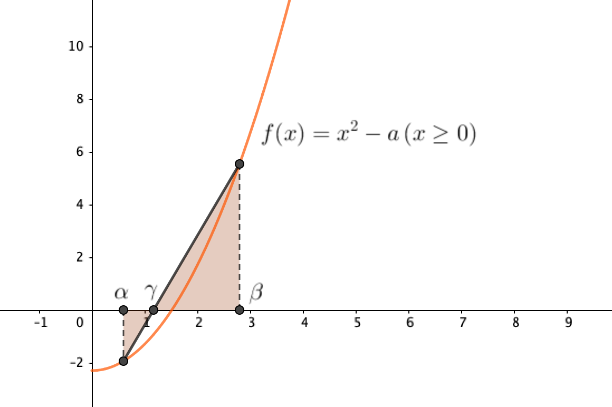

# 开平方根

## 平方根

一般地，$\forall a \in \mathbb{R}_+$，$\exists x \in \mathbb{R}$，使得$x^2 = a$，则称$x$为$a$的**平方根**，记作

$$
x = \pm\sqrt{a}
$$

不难看出，$x$有两个可能的取值，一正一负；我们称其中的正值称为$a$的**算术平方根**。即，$\forall a \in \mathbb{R}_+$，$\exists x \in \mathbb{R}\_+$，使得$x^2 = a$，则称$x$为$a$的**算术平方根**，记作

$$
x = \sqrt{a}
$$

特别地，$0$的平方根和算术平方根都是$0$，即$\pm\sqrt{0} = \sqrt{0} = 0$。

本文中所有的“开平方根”都是指求正实数的算术平方根。

## 开平方根的方法

这里主要讨论以下几种开平方根的方法：

1. [试数法](#试数法)
2. [长除式法](#长除式法)
3. [牛顿迭代法](#牛顿迭代法)

### 试数法

试数法指通过尝试、枚举来得到一个数的平方根的方法。

#### 一般试数法

顾名思义，一个一个试。这种方法比较低级，且计算量大。

#### 二分法

设正实数$a$为待开方数，假设有正实数$\alpha, \beta$使得$\alpha^2 \le a \le \beta^2$，那么易有$\alpha \le \sqrt{a} \le \beta$，即$\sqrt{a} \in \left[\alpha, \beta\right]$。取$\alpha, \beta$的算术平均值$m = \frac{\alpha + \beta}{2}$，若$\alpha^2 \le a \le m^2$，则$\sqrt{a} \in \left[\alpha, m\right]$；否则$\sqrt{a} \in \left[m, \beta\right]$。如此循环往复，所得$\sqrt{a}$的取值区间将会不断变窄，最终达到所需要的精度。

事实上，求$a$的算术平方根即求函数$f(x) = x^2 - a\left(x \ge 0\right)$的零点。由**零点存在定理**可得，对于$0 \le \alpha \le \beta$且$f\left(\alpha\right) \cdot f\left(\beta\right) \le 0$，那么$\exists x_0 \in \left[\alpha, \beta\right], f(x_0) = 0$，即零点位于$\alpha$和$\beta$之间。通过不断二分区间，不断缩小根的取值范围，可以得到任意精度的平方根。

此方法效率较高，在所求精度的范围内，若$\alpha$和$\beta$之间有$n$个不同的可能值（设所求精度为$\epsilon$，则$n = \frac{\beta - \alpha}{\epsilon}$），则需要进行的迭代次数为$\log_2 n$。

#### 试位法（线性插值法）

线性插值法是二分法的优化。假设有$f\left(\alpha\right) \cdot f\left(\beta\right) \le 0$，即$\sqrt{a} \in \left[\alpha, \beta\right]$，那么作过点$\left(\alpha, f\left(\alpha\right)\right)$和点$\left(\beta, f\left(\beta\right)\right)$的直线，该直线交$x$轴于一点$\left(\gamma, 0\right)$，那么：若$f\left(\alpha\right) \cdot f\left(\gamma\right) \le 0$，则$\sqrt{a} \in \left[\alpha, \gamma\right]$；否则$\sqrt{a} \in \left[\gamma, \beta\right]$。

由三角形相似可知，

$$
\frac{f\left(\alpha\right)}{\gamma - \alpha} = \frac{f\left(\beta\right)}{\gamma - \beta}
$$

解得

$$
\gamma = \frac{\beta f\left(\alpha\right) - \alpha f\left(\beta\right)}{f\left(\alpha\right) - f\left(\beta\right)}
$$

二分法与试位法的区别在于，前者是以区间的中点划分区间，而后者是以区间端点在函数图象上的对应点的连线与$x$轴的交点划分区间。一般情况下，后者更优一些，但相比于后面的方法，还是略逊一筹。

### 长除式法

将待开方实数$a$写成小数形式，并以小数点为起点，将$a$的每两位截为一节。以$148.5961$为例。

$$
\begin{array}
{c}
\hline
\Big) & 1 & 48 & . & 59 & 61\\
\end{array}
$$

先计算最高一节的平方根，所得的余数落下（在这里余数为$0$）：

$$
\begin{array}
{c}
& 1\\
\hline
\Big) & 1 & 48 & . & 59 & 61\\
& 1\\
\hline
& & 48
\end{array}
$$

之后，对于每一节都进行以下操作：设$W$为已求得的数值（比这一节位数更高），$N$为这一节落下来的数，$M(d) = d \cdot \left(20W+d\right)$，则这一节的数值为

$$
d = \max \left\{d|M(d) \le N\right\}
$$

注意，每一节虽然是两位数，但求得的平方根是一位数。整个过程忽略小数点，将待开方数看作整数处理。

这里，$W = 1, N = 48$，有$d \cdot (20 + d) \le 48$，$d$最大取到$2$，$M(d)$最大取到$44$，第二节的结果为$2$，所得余数$N - M(d)$落下：

$$
\begin{array}
{c}
& 1 & \phantom{0}2\\
\hline
\Big) & 1 & 48 & . & 59 & 61\\
& 1\\
\hline
& & 48\\
& & 44\\
\hline
& & \phantom{0}4 & . & 59
\end{array}
$$

重复上述过程，$W = 12, N = 459$，$d$最大取到$1$，$M(d)$最大取到$241$，余数落下：

$$
\begin{array}
{c}
& 1 & \phantom{0}2 & . & \phantom{0}1\\
\hline
\Big) & 1 & 48 & . & 59 & 61\\
& 1\\
\hline
& & 48\\
& & 44\\
\hline
& & \phantom{0}4 & . & 59\\
& & \phantom{0}2 & . & 41\\
\hline
& & \phantom{0}2 & . & 18 & 61
\end{array}
$$

继续，$W = 121, N = 21861$，$d$最大取到$9$，$M(d)$恰好最大取到$21861$，余数为$0$：

$$
\begin{array}
{c}
& 1 & \phantom{0}2 & . & \phantom{0}1 & \phantom{0}9\\
\hline
\Big) & 1 & 48 & . & 59 & 61\\
& 1\\
\hline
& & 48\\
& & 44\\
\hline
& & \phantom{0}4 & . & 59\\
& & \phantom{0}2 & . & 41\\
\hline
& & \phantom{0}2 & . & 18 & 61\\
& & \phantom{0}2 & . & 18 & 61\\
\hline
& & & & & \phantom{0}0
\end{array}
$$

得到$\sqrt{148.5961} = 12.19$。

下面将探讨上述方法的原理。

令$x = \sqrt{a}\left(a \in \mathbb{N}_+\right)$，设$x = 10W + d\left(W,d \in \mathbb{N}, 0 \le d \le 9\right)$，则有

$$
\begin{aligned}
a &= x^2\\
&= \left(10W + d\right)^2\\
&= 100W^2 + 20Wd + d^2\\
&= 100W^2 + d \cdot \left(20W + d\right)
\end{aligned}
$$

因此，我们将$a$的每两位截为一节，考虑其中的一节：

$$
\overline{a_1a_2}
$$

设这一节开方后所得的对应数位为$d$，这一节之前的部分开方得到的数（即$d$这一位之前的数）为$W$，那么这一节及其之前的部分为

$$
100W^2 + d \cdot \left(20W + d\right) + r
$$

其中，$100W^2$不影响$\overline{a_1a_2}$，$r$是开方后留到下一节的余数，那么有

$$
\overline{a_1a_2} = d \cdot \left(20W + d\right) + r = M(d) + r
$$

当$M(d)$最大时，这一节开尽，$r$最小。不断重复这一操作，直至开尽每一节，$r = 0$，即得到$a$的平方根。

### 牛顿迭代法

设$a$为待开方数，$x_0$为任意实数（事实上，$x_0$与$\sqrt{a}$越接近，所需迭代次数越少），定义如下数列$\\{x_n\\}$：

$$
x_{n} = \frac{1}{2} \left(x_{n-1} + \frac{a}{x_{n-1}}\right) \left(n \ge 1\right)
$$

以下讨论均在$n \ge 1$的条件下进行。

由均值不等式有

$$
x_n = \frac{1}{2} \left(x_{n-1} + \frac{a}{x_{n-1}}\right) \ge \sqrt{a} \ \left(\text{取等} \iff x_{n-1} = \sqrt{a} \right)
$$

若$x_{n-1} = \sqrt{a}$，则得到$\sqrt{a}$。设$x_{n-1} \ne \sqrt{a}$（即数列中任意一项均不等于$\sqrt{a}$），有

$$
x_n > \sqrt{a}
$$

同时，注意到

$$
\begin{aligned}
x_n - \sqrt a
&= \frac{1}{2} \left(x_{n-1} + \frac{a}{x_{n-1}}\right) - \sqrt a\\
&= \frac{1}{2x_{n-1}} \left(x_{n-1}^2 - 2x_{n-1}\sqrt a + a\right)\\
&= \frac{1}{2x_{n-1}} \left(x_{n-1} - \sqrt a\right)^2\\
&= \frac{x_{n-1} - \sqrt a}{x_{n-1}} \cdot \frac{1}{2} \left(x_{n-1} - \sqrt a\right)\\
&< \frac{1}{2} \left(x_{n-1} - \sqrt a\right)\\
&\le \frac{1}{2^n} \left(x_0 - \sqrt a\right)\ \left(\text{取等} \iff n = 1\right)\\
\end{aligned}
$$

因此，数列$\\{x_n\\}$有如下性质：

$$
0 < x_n - \sqrt a < \frac{1}{2^n} \left(x_0 - \sqrt a\right)
$$

又$\lim_{n \to \infty} 0 = \lim_{n \to \infty} \frac{1}{2^n} \left(x_0 - \sqrt a\right) = 0$，由**夹逼定理**有$\lim_{n \to \infty} \left(x_n - \sqrt a\right) = 0$，即数列$\\{x_n\\}$的极限为

$$
\lim_{n \to \infty} x_n = \sqrt a
$$

在实际使用中，迭代次数取决于所需要的精度。一般来说，迭代两到三次时精度已能达到两位小数。

事实上，因为$\sqrt a$为函数$f(x) = x^2 - a\left(x \ge 0\right)$的零点（根），用牛顿法求$f(x)$零点的过程为：

$$
\begin{aligned}
x_{n+1}
&= x_n - \frac{f\left(x_n\right)}{f'\left(x_n\right)}\\
&= x_n - \frac{x_n^2 - a}{2x_n}\\
&= x_n - \frac{x_n}{2} + \frac{a}{2x_n}\\
&= \frac{1}{2} \left(x_n + \frac{a}{x_n}\right)
\end{aligned}
$$

与上述方法相同，故上述方法称为牛顿迭代法。